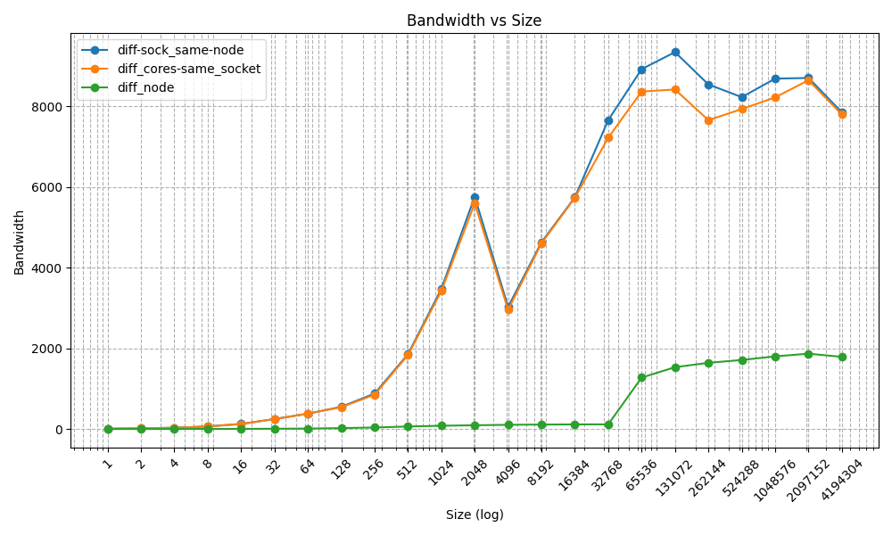
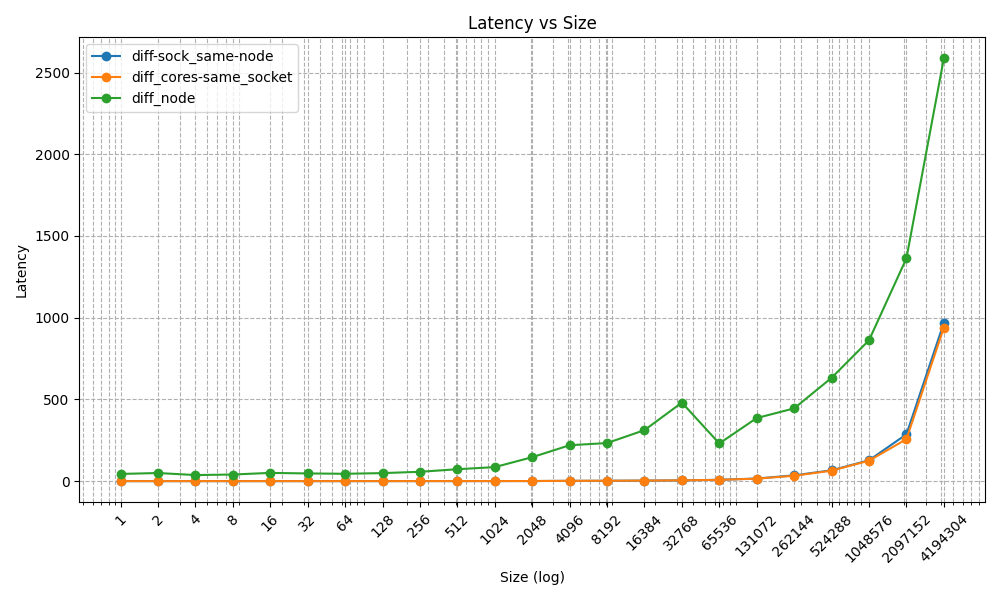

# Exercise Sheet 01
Team: Marco Fröhlich and Lilly Schönherr

## Task 1
> Study how to submit jobs in SLURM, how to check their state and how to cancel them:

- Start a job: `sbatch [options] <job.slurm> [job_options]`
- Check state: `sq -u <username>` or `squ`
- Stop a job: `scancel <job_id>`

> Prepare a submission script that starts an arbitrary executable, e.g. `/bin/hostname`:

```bash
#!/bin/bash

# Execute job in the partition "lva" unless you have special requirements.
#SBATCH --partition=lva
# Name your job to be able to identify it later
#SBATCH --job-name test
# Redirect output stream to this file
#SBATCH --output=%x_%j_%N.out
# Maximum number of tasks (=processes) to start in total
#SBATCH --ntasks=1
# Maximum number of tasks (=processes) to start per node
#SBATCH --ntasks-per-node=1
# Enforce exclusive node allocation, do not share with other jobs
#SBATCH --exclusive

module load openmpi/
mpiexec -n $SLURM_NTASKS /bin/hostname
```
Variable declaration:

- `%x` -> job name
- `%j` -> job id
- `%N` -> short host name

> In your opinion, what are the 5 most important parameters available when submitting a job and why? What are possible settings of these parameters, and what effect do they have?

1. `#SBATCH --ntasks`: Defines the number of tasks started with the default being 1.
2. `#SBATCH --ntasks-per-node`: Defines how many tasks should be executed per node. In combination with the number of total tasks, this option is important for resource management and with that also performance.
3. `#SBATCH --time`: Defines a timeout for the job. After running for the specified amount of time, a TERM signal is sent to the process followed by a KILL signal 30 seconds later. This prevents dead processes from filling up the system while still allowing for a graceful shutdown.
4. `#SBATCH --exclusive`: Ensures that the requested resources will be used for this job exclusively instead of possibly sharing them with other jobs. This reduces reduces the influence of outside factors on the performance of the program.
5. `#SBATCH --job-name`: Sets the jobs name. This allows for easier job management.


> How do you run your program in parallel? What environment setup is required?

In addition to the parameters for the job, the SLURM file needs to contain the following commands:
- load the openmpi module: `module load openmpi`
- run the job: `mpiexec -n $SLURM_NTASKS <command>`

The SLURM script can then be run with: `sbatch <script>`

## Task 2
 
The programs need exactly two tasks to work, therefore `--ntasks=2` for all test runs. To see which SLURM parameters were set for the different configurations, please consider the SLURM files.


### Results
Below you can see the average results over three different test runs of the different configurations with the bandwith being measured in MB/s and the latency in us. Noteably, the measurements with a size of 0 were removed from the graphic to enable logarithmic scaling of the x axis. 

As was to be expected, using running the ranks on different nodes was the least efficient configuration. The other two configurations behaved very similarly with the one placing the ranks on different sockets of the same node slightly outperforming the configuration which placed both ranks on the same socket. 

Interestingly, the measured bandwidth of the configuration which assigns both tasks to the same socket and the configuration which runs them on different sockets of the same node both decrease significantly when increasing the message size from 2048 to 4096 while the configuration using different nodes does not display this behaviour.





> How can you verify rank placement without looking at performance?

With the following commands, one can obtian information about currently running jobs: 
- Once a job is started one can see how many and which nodes are in use with `squ`.
- With `sstat --jobs=<ID>` additional information can be displayed. We recommend to pipe the output to a file since it is difficult to read in the terminal.

Although one can find out a lot about the resource allocation of the current jobs with these commands, they do not directly tell us anything about rank placement. Sadly, we were not able to find a method of doing this. 

> How stable are the measurements when running the experiments multiple times?

- Different Cores of the same Socket: The measured latency values are very stable. Altough there is some variance in the measured bandwidth values, the overall trends such as the dip in bandwidth when going from a message size of 2048 to 4096 are clearly visible in all of the performed test runs. 
- Different Sockets of the same Node: Similar behaviour to different cores of the same socket.
- Different Nodes: While two of the performed test runs have very similar measurements, the third one was significantly slower with a higher latency and a lower bandwidth.
