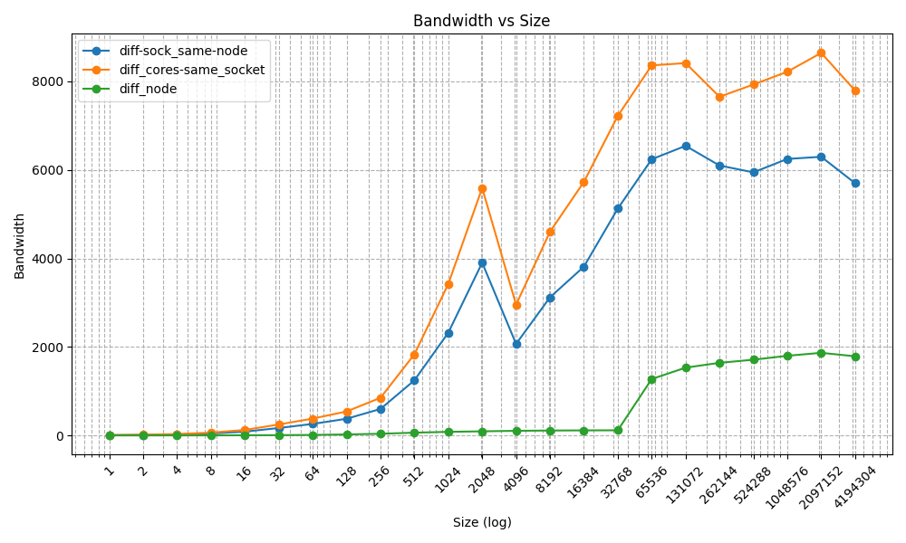
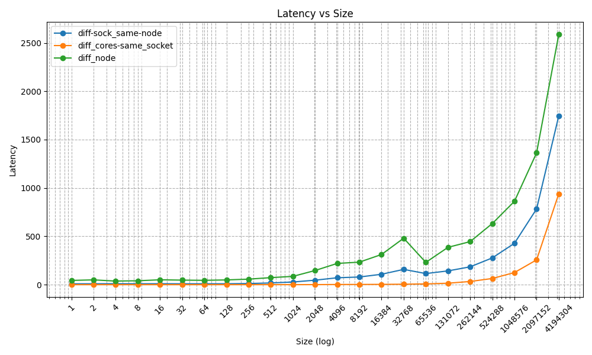

# Exercise Sheet 01
Team: Marco Fröhlich and Lilly Schönherr

## Task 1
> Study how to submit jobs in SLURM, how to check their state and how to cancel them:

- Start a job: `sbatch [options] <job.slurm> [job_options]`
- Check state: `sq -u <username>` or `squ`
- Stop a job: `scancel <job_id>`

> Prepare a submission script that starts an arbitrary executable, e.g. `/bin/hostname`:

```bash
#!/bin/bash

# Execute job in the partition "lva" unless you have special requirements.
#SBATCH --partition=lva
# Name your job to be able to identify it later
#SBATCH --job-name test
# Redirect output stream to this file
#SBATCH --output=%x_%j_%N.out
# Maximum number of tasks (=processes) to start in total
#SBATCH --ntasks=1
# Maximum number of tasks (=processes) to start per node
#SBATCH --ntasks-per-node=1
# Enforce exclusive node allocation, do not share with other jobs
#SBATCH --exclusive

module load openmpi/
mpiexec -n $SLURM_NTASKS /bin/hostname
```
Variable declaration:
- `%x` -> job name
- `%j` -> job id
- `%N` -> short host name

> In your opinion, what are the 5 most important parameters available when submitting a job and why? What are possible settings of these parameters, and what effect do they have?

1. `#SBATCH --ntasks`: Defines the number of tasks to start, default 1.
2. `#SBATCH --ntasks-per-node`: Defines how many of the above defines tasks will be executed per node. Important with the above option for resource management and with that performance.
3. `#SBATCH --time`: Defines a timeout for the job to prevent dead processes from filling up the system. Performs a graceful shutdown by first sending a TERM signal and 30sec later a KILL signal.
4. `#SBATCH --exclusive`: Ensures to get the nodes exclusively and not sharing resources.
5. `#SBATCH --job-name`: Sets the jobs name to make it easier to identify them later, especially when using this variable for the output files name.


> How do you run your program in parallel? What environment setup is required?

The following steps need to be done inside the SLURM file:
- load the openmpi module: `module load openmpi`
- run the job: `mpiexec -n $SLURM_NTASKS <command>`
Run the SLURM script with: `sbatch <script>`

## Task 2
 
The programs need exactly two tasks to work, therefore `--ntasks=2` for all. For the different configurations, see the SLURM files.


### Results
As expected for the bandwidth results using different cores on the same socket was the fastest and different nodes the slowest.





> How can you verify rank placement without looking at performance?

- Once a job is started with `squ` one can see how many and which nodes are in use.
- With `sstat --jobs=<ID>` additional information can be displayed. We recommend to pipe the output to a file since its to much for the terminal.