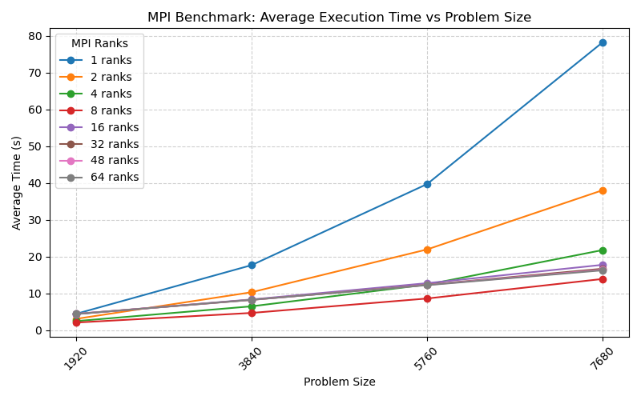

# Exercise Sheet 02

**Team:** Marco Fröhlich and Lilly Schönherr

# Task 1: Monte Carlo Pi
> Consider a parallelization strategy using MPI. Which communication pattern(s) would you choose and why?

There is only one point at which the ranks need to communicate with each other which is when the sum of sampled points inside the circle needs to be calculated. For this purpose, we would choose the `MPI_Reduce` pattern as it is designed to reduce the results of multiple ranks into one.

# Task 2: Heat Stencil in 1D

## Idea for parallelization

The main idea of the is to split the $N$ celled object into subsections. Each of the $M$ MPI ranks takes care of one of these sections, we assert that $N \mod M = 0$, meaning that each subsection has the same size and there is nothing left. Additionally each node needs to keep track of one cell to each side. This is needed to communicate changes in temperature to neighboring sections.

The algorithm used for the  temperature computation is defined by the following pseudo code:

```
section_size = get_section_size()
temp_vector = get_subsection()
for T do:
    send_left_edge()
    temp = receive_left_edge()
    temp_left = max(temp_left, temp)

    send_right_edge()
    temp = receive_right_edge()
    temp_right = max(temp_right, temp)

    compute_temperatures()
end
```

This communication pattern ensures synchronization of all needed information from $t \rightarrow t+1$, since each rank can only compute $t+1$ when it received the information of $t$ from its neighbors.

## Results

The implementations were compiled with the optimization flag `-Ofast`.Experiments were conducted with num_rank=$[1, 2,4,8,16,32,48,64]$. In the case that `num_rank ==1` the sequential implementation was used. Unfortunately on Sunday morning only 7 nodes of the LCC3 were available therefore no experiment with 96 ranks could be conducted. Since the implementation requires an even divisibility of the number of ranks and the problem size this results in problem sizes needing to be multiples of 192 because that is the least common multiple of the chosen rank sizes. All configurations were run 5 times in total and the wall clock time was measured using `/usr/bin/time`, there resulting times were averaged and can be seen in the plot below.



As can be seen, the experiments with 8 ranks were the fastest.
In second place is nearly identical where the runs using 32-64 ranks.
We think the rank 8 implementation is the fastest because a CPU on the LCC3 has 12 cores and 8 tasks this is the biggest configuration that fits on one CPU.
Being on only one CPU makes communication between MPI ranks very fast.

