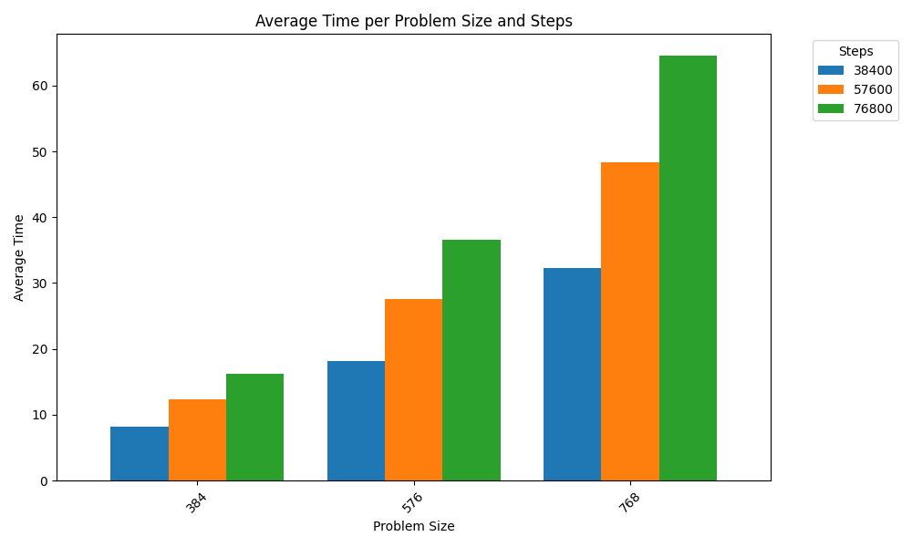
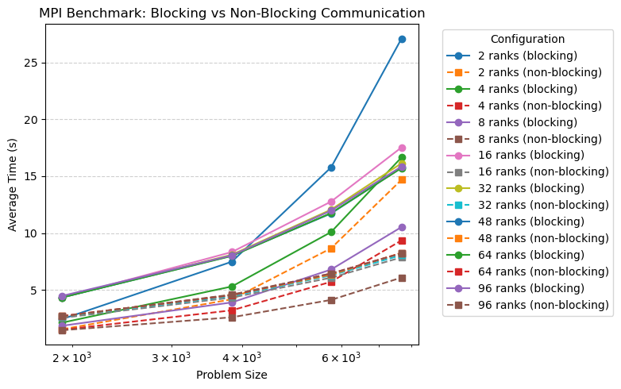
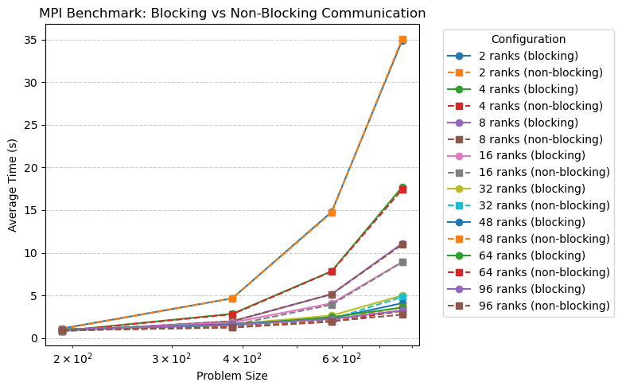

# Exercise Sheet 04

**Team:** Marco Fröhlich and Lilly Schönherr

# Task 1
To make it more efficient, we removed all conditionals from the time step loop of the heat stencil computation. With five types of conditionals being removed (four bound checks and one check whether the current point is the heat source), for `N = 768` and `T = 768 * 100` this means that there were `5 * 768 ^ 3 * 100 = 226 492 416 000` less conditions to be checked. 

> Run your programs with multiple problem and machine sizes and measure speedup and efficiency. Consider using strong scalability, weak scalability, or both. Justify your choice.

First, we tested the performance of our sequential implementation with problem sizes ranging from 384 to 768 and time steps ranging from 384 * 100 to 768 * 100. The averaged results of this are displayed below.

These results show that the program runtime is linearly proportional to the number of time steps as doubling the number of time steps also doubles the program runtime. Doubling the grid size leads to the program runtime being quadruplicated which also is the expected behaviour.

As the program runtime scaled linearly with the time steps, we decided to fix the value to 768 * 100 for our future tests as this would lead to measurements that can be displayed more easily without losing interesting information. The performance measurements of the parallel version can be viewed further below. 

We ended up choosing a compromise between strong scalability (keeping both grid size and time steps fixed) and weak scalability (scaling both time steps and and grid size with the number of ranks). We did this to simplify the resulting data while still keeping track of interesting behaviour that might arise from buffers overflowing etc. that might not be discovered when totally fixing the problem size. 

> Measure and illustrate one domain-specific and one domain-inspecific performance metric. What can you observe?

We already measured one domain-inspecific performance metric, namely the wall-clock time. To obtain a domain-specific measurement, we can connect the measured wall-clock time to the number of cells computed in total and compute the cells/s. For a grid size of 768 and 768 * 100 time steps, there are (768 * 768 - 1) * 768 * 100 = 45 298 406 400 cells that need to be computed. This leaves us with 45 298 406 400 / 64.06 = 707 124 670.62 cells/s for the sequential version and 45 298 406 400 / 3.24 = 13 980 989 629.63 cells/s for the blocking parallel version.

> How can you verify the correctness of your applications?

We kept the sanity check whether the final grid contains no values that are below 273 or above 333. Additionally, during development, we also printed the final heat stencil. 

# Task 2
## 1D Version
The implementation for the 1-dimensional version of the heat stencil is based on the code from exercise sheet 02.
The only adaptions made are to remove the scatter call for the initial setup and little rework on the logic used by each
rank to identify if the heat source is in its subsection.
Since the original version used `MPI_SendRecv()` for ghost cell communication it was used to benchmark the blocking 
communication. 
The non-blocking version uses `M̀PI_Isend()` and `MPI_IRecv()` calls for data exchange. 
Other than that, this implementation
works like described in the exercise text. In each time iteration, the ranks initiate a non-blocking communication and then 
 immediately start the temperature calculations for the inner cells. When those calculations are done, the ranks check
if the data exchange is finished with `MPI_Waitall()` and afterward perform the temperature propagation for the edge cells.

The results can be seen in the following plot. 
The results display the arithmetic mean of 5 individual runs for all configurations.

It can clearly be seen that the non-blocking implementation is faster for bigger problem sizes. 
The only exception to this is the 48-rank non-blocking version, which is slower than the 8-rank blocking version.

## 2D Version
For the 2D implementation basically only the `MPI_SendRecv()` were replaced by `M̀PI_Isend()` and `MPI_IRecv()` calls.
And the computation order was changed to first calculate the middle cells and after an added `MPI_WaitAll()` the 
edges get computed.

The results can be seen in the following plot. 
The results display the arithmetic mean of 5 individual runs for all configurations.

It can be seen that using non-blocking communication basically changed in terms of computation time.
When looking at the raw data for the biggest used experiment setting the blocking implementation had a mean execution time 
of $3.24$s whereas the non-blocking took $2.754$s, which is a speedup of $17\%$.