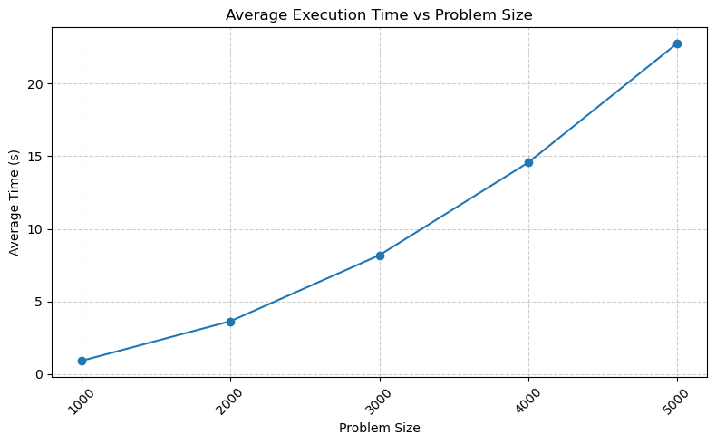

# Exercise Sheet 04
**Team:** No team this time, just me.

# Task 1:
The sequential implementation was compiled with `-Ofast`. All time measurements where done using with `clock_gettime(CLOCK_MONOTONIC,...)` and only the computation loop was measured, meaning no initialization and I/O. The results display the arithmetic mean of 10 executions per configuration with a fixed number of time steps of 100.

As expected the execution time increases exponentially with increased execution time.

## Tales of development:
Now follows a short list of things I tried to make this sequential code faster:

- Using the `inline` keyword for all functions $\rightarrow$ did not change the runtime since, since the compiler does this automatically when using `-Ofast`
- using direct multiplication instead of `pow(..,2)` $\rightarrow$ did not change the runtime probably done by `-ffast-math`, but I was to lazy to change it back.
- Using the compiler flag `-march=native` since AI suggested it to allow the compiler to exploit architecture dependent optimizations if possible, and it's not set by `-Ofast` $\rightarrow$ did not affect the runtime unsure if it even worked.

# Task 2:
The problem with *n-body* simulation is that on every time step each particle depends on all other particles in the system. In very large systems it would be possible to only look at particles in a certain range, since the contribution declines with $1/r^2$ and at some point gets negligible. Also, possible would be to bundle the force contribution of distant particles by some finite number of directions, which would make the calculation possible faster and more precise than the previous method. But since this type of optimizations would also be possible for the sequential implementation it will not be pursued further.

There are two ways to parallelize the problem:
- divide the space
- divide the particles

Since particles can and possible will move between cells and handling this seems not worth the effort I choose the second option.

The remaining problem is how to communicate the data between all ranks after each time step. Let's explore a few options:
- *Cartesian topology*: Makes in this case no sense since all other ranks are *neighbors* of each rank.
- *Invoke `MPI_Bcast(...)` on every rank*: Could work, required management of where the data is written on the receiving node to that nothing gets lost. But requires an additional loop over every rank for every time step.
- *Use management node*: Here one rank gather all particle information after each computation and scatters it later to all ranks. I think this introduces a lot of downtime for the worker nodes.
- *Graph topology*: Since the communication pattern is All-to-All a fully connected graph is a viable option. Then each node is each other's neighbor and data can be exchanged by a single `MPI_Neighbor_alltoall(...)`. But the overhead for creating such a structure might be very expensive. Maybe this would be a viable strategy, if other assumptions are in place such that not all nodes need to be directly connected. 
- *Use `MPI_Alltoall(...)`*: Build in function that does exactly what's needed, namely share a certain amount of data with all others and also receive it.

### Implementation plan:
My approach to parallelize the *n-body* simulation is to split the number of particles between the ranks. Each ranks than generated the initial random parameters of its particle section and communicates this to all other nodes. After each time step this synchronization is repeated. If enable, one node performs after sync the I/O operation of saving the systems state.

My choice of communication pattern is the simplest one of `MPI_Alltoall(...)` since it was developed exactly for this kind of situation.