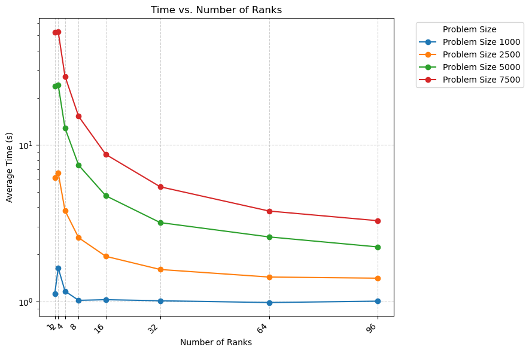

# Exercise Sheet 06

**Team:** Marco Fröhlich and Lilly Schönherr

# Task 1:
We parallelized the implementation from Assignment 5 using `MPI_Allgather(...)`. The parallel version does not take advantage of the force symmetries, except that the algorithm for calculation is the same as in the sequential version. This is because we wanted to minimize the amount of communication necessary. Each rank gets a section of particles assigned and computes everything for them. Before beginning the computation loop the initial positions and masses are exchanged between the ranks, since those are also randomly set by the ranks responsible. Due to time limitations' no optimized calculation approach like *Barnes-Hut* was implemented. 

All measurements are the arithmetic mean of 5 individual runs per configuration. The code was compiled with `-Ofast` with gcc-12 and openmpi-3-16. The measured time is the wall time by `/usr/bin/time` and includes setup and writing the output every 10th time step to a file using `fprintf(...)`.

In the following plot the execution times depending on the number of ranks are shown. Interestingly the using only 2 ranks increases the computation time for smaller problem sizes. Also for smaller number of bodies the increase of ranks those not speed up the computation significantly.

Here the speed-up depending on the number of ranks is shown. Non surprisingly the bigger the problem the more it benefits from more computation power in form of more ranks. For 1000 and 2500 bodies the speed-up flattens out with more ranks, whereas the for more there is still a clear speed-up visible. But the speed-up is never linear, since $t_p < t_s/p$

# Task 2:
