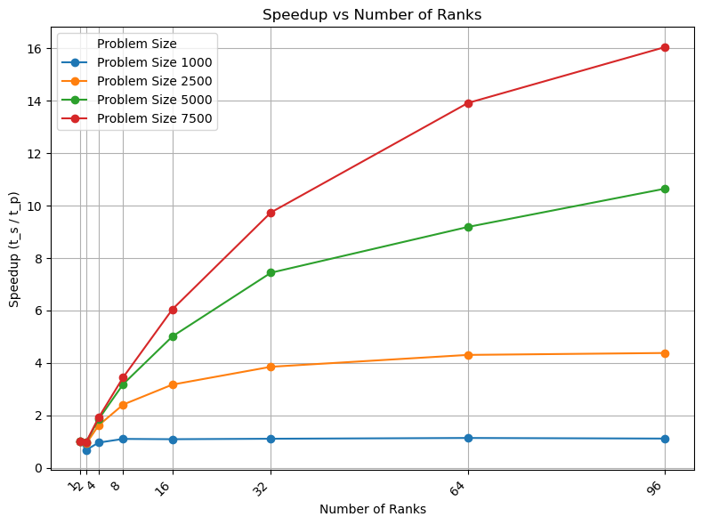
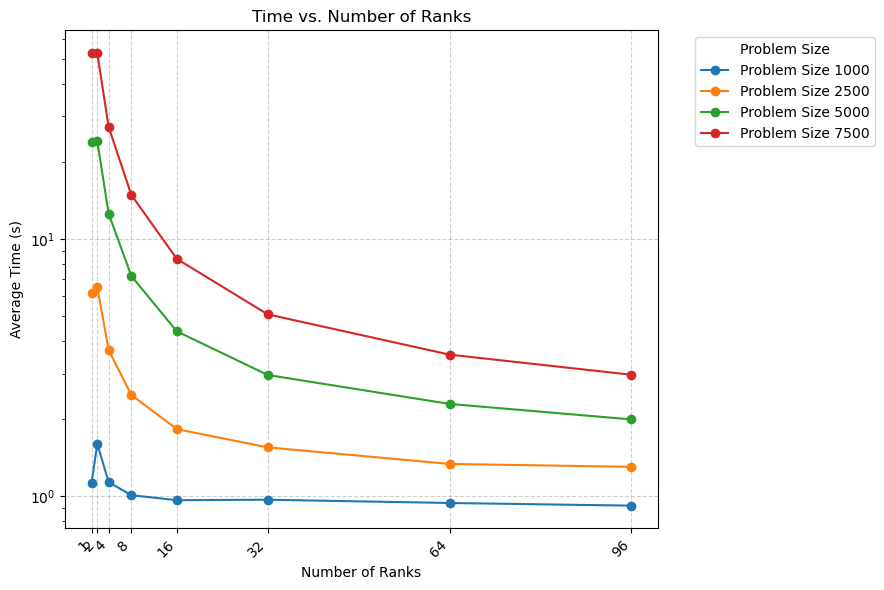
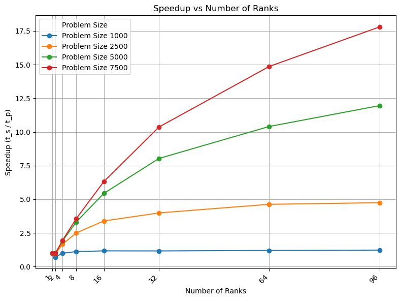

# Exercise Sheet 06

**Team:** Marco Fröhlich

# Task 1:
We parallelized the implementation from Assignment 5 using `MPI_Allgather(...)`. The parallel version does not take advantage of the force symmetries, except that the algorithm for calculation is the same as in the sequential version. This is because we wanted to minimize the amount of communication necessary. Each rank gets a section of particles assigned and computes everything for them. Before beginning the computation loop the initial positions and masses are exchanged between the ranks, since those are also randomly set by the ranks responsible. Due to time limitations' no optimized calculation approach like *Barnes-Hut* was implemented. 

All measurements are the arithmetic mean of 5 individual runs per configuration. The code was compiled with `-Ofast` with gcc-12 and openmpi-3-16. The measured time is the wall time by `/usr/bin/time` and includes setup and writing the output every 10th time step to a file using `fprintf(...)`.

In the following plot the execution times depending on the number of ranks are shown. Interestingly the using only 2 ranks increases the computation time for smaller problem sizes. Also for smaller number of bodies the increase of ranks those not speed up the computation significantly.

Here the speed-up depending on the number of ranks is shown. Non surprisingly the bigger the problem the more it benefits from more computation power in form of more ranks. For 1000 and 2500 bodies the speed-up flattens out with more ranks, whereas the for more there is still a clear speed-up visible. But the speed-up is never linear, since $t_p < t_s/p$

The efficiency is for 5000 particles and 96 ranks is: $\text{efficiency}_{96}= \frac{10.67}{96} \approx 0.11$. This proves the argument from earlier that the speed-up is not linear.

# Task 2:
When comparing the uniform with coordinates $x,y,z \in \{-100,100\}$ distribution from Task 1 with a distribution which only uses 10%  of the available space, $x,y,z \in \{-10,10\}$, it can be observed that the execution times are for more ranks are slightly faster. Since the scales are in log a concrete example with values for 5000 particles can be seen in the following table:

|ranks|time uniform|time corner|
|---|---|---|
|1|23.73|23.79|
|96|2.23|1.99|

This also reflects in the speed-up where 96 ranks on 5000 particles now achieve a value of 11.96 instead of 10.67 for the uniform distribution.

In terms of efficiency this boosts the value for 5000 particles to $\text{efficiency}_{96}= \frac{11.96}{96} \approx 0.12$. Which is a significant (not) increase of 0.1.

These results are to be expected since the used algorithm is the most naive one possible which can not take advantage of any spacial optimization. If for example the Barnes-Hut algorithm had been used I expected a decrease in performance the closer the particles are together, since then the distance condition can not be fulfilled, and one ends up again at calculating the forces between each pair.

# Sidenote
A nice comparision between different implementation for the *N-Body Problem* can be found in the paper *[On Distributed Gravitational N-Body Simulations](https://arxiv.org/abs/2203.08966)* by Alexander Brandt, which also included [Code](https://github.com/alexgbrandt/Parallel-NBody/). The code was not executable on the LCC3 due to missing packages for the visualization.