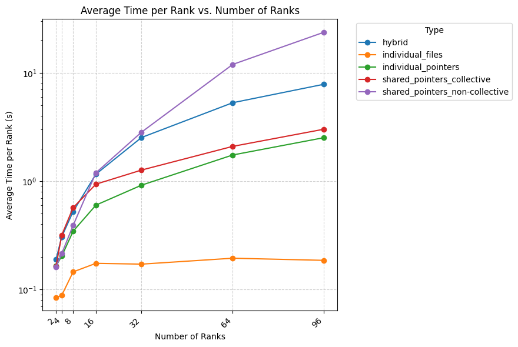
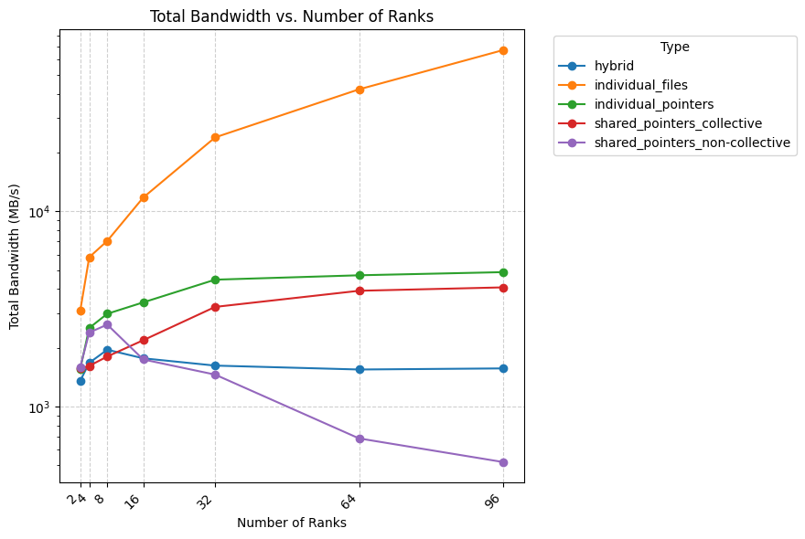

# Exercise Sheet 06

**Team:** Marco Fröhlich and Lilly Schönherr

# Performance Comparison
The measured average execution time per rank (excluding initialization and setup) can be seen in the figure below. For these measurements, the workload grew with the number of ranks to ensure that for each test configuration, each rank worked on 64 MB of data.

With this in mind, it is not surprising that the program version using individual files is the fastest as it requires the no synchronisation between ranks. There is a considerable increase in its average time per rank between 4 and 8 ranks, likely due to the ranks being split on different nodes. There is a much smaller increase when going from 8 to 16 ranks, but after that the average time values stay more or less the same.  

The implementation with the second-largest average speed is the one using individual file pointers. While this version benefits from each rank being able to read and write its part of the file without time synchronisation, it is still slowed down by the added overhead of file synchronisation. Using shared pointers with collective I/O operations produces results that are very similar. 

The second-slowest implementation is the hybrid version in which only one rank performs any I/O operations. That this is not the slowest version comes with some surprise, after all does it not only not include any sharing of the workload for the I/O part, but it also does not eliminate the need for ranks to be in communication with each other. 

The slowest version is the one using shared pointers without collective I/O operations. The poor performance of this version of the program is likely the result of excessive file synchronisation. 

Our second graph shows how the total bandwidth differ between the different implementations. The implementation using individual files has by far the most bandwidth and is the only implementation that still exhibits growth in the bandwidth for high numbers of ranks. The bandwidth of the second and third-fastest implementation grows very slowly and begins to stagnate at 32 ranks. 

For the hybrid implementation, the bandwidth actually starts to decrease past 8 ranks, but the changes become insignificant after reaching 16 ranks. The bandwidth of the implementation using shared pointers and non-collective I/O operation is actually third largest up to 8 ranks, after which it starts to decrease rapidly and irregularly. Besides the implementation using individual files, it is the only implementation whose bandwidth does not appear to be stabilized at 96 ranks. 