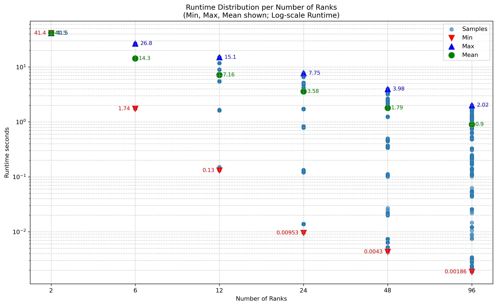
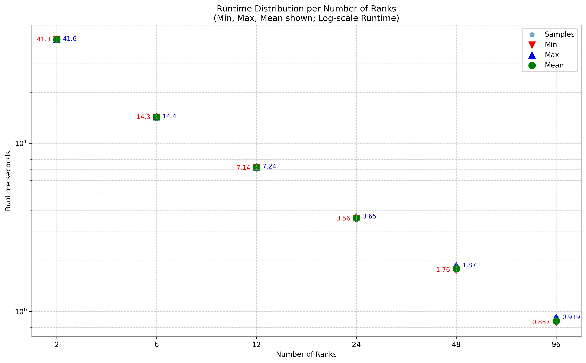

# Exercise Sheet 09

**Team:** Marco Fröhlich and Lilly Schönherr

# Task 1

## Naive paralell
The naive parallel implementation was done by splitting the image in the y-axis. Each ranks gets `size_y / num_ranks` rows assigned and `rank 0` takes the remainder. Then each rank individually computes the Mandelbrot numbers and at the end a `MPI_Gatherv(...)` collects the results and computes the final image. Time measurements only enclose the `calcMandelbrot(...)` method call.

In the following plot a scatter of the different runtimes of each rank are shown. It contains multiple runs with for each number of ranks which all were done with the same image size of `3840x2160`. 

Non surprisingly the variation in runtime for the individual ranks increases with growing number of ranks. In the following table the relative and absolute differences between lowest and fastest measurement are shown using the following formula: $\text{slow}_\% = \frac{\max-\min}{\min}*100$

| number of ranks | min[s] | max[s] | $\text{slow}_\%$ | absolute diff[s] |
|-----------------|--------|--------|------------------|------------------|
| 2               | 41.4   | 41.5   | 0.24 %           | 0.01             |
| 6               | 1.74   | 26.8   | 1,440 %          | 25.6             |
| 12              | 0.13   | 15.1   | 11,515 %         | 14.97            |
| 24              | 0.0095 | 7.75   | 81,478 %         | 7.7405           |
| 48              | 0.0043 | 3.98   | 92,458 %         | 3.9757           |
| 96              | 0.0019 | 2.02   | 10,531 %         | 2.0181           |

Interestingly the variance has a peak somewhere between 48 and 96 ranks and does not increase with increasing size of ranks.

## Improvement Ideas
1. **Random Distribution:**
Instead of giving each rank a continuous chunk of data, it gets a random selection of points to work with. This is possible since the computation is not dependent on neighboring entities. Hopefully statistics are then in our favor and the load gets balanced since all ranks get an even amount of expensive and cheap points.

2. TBA by Lilly.

# Task 2
## Random Distribution
This optimization works by randomly distributing a certain chunk of points to each rank. Since the individual point calculations are independent of each other this is possible, but takes a time to set up. Since each point needs to know its global position this has to be precomputed by one rank and then be distributed. Afterward, the received data has to gathered and reconstructed to compute the final image. This introduces performance loss, since the set-up and sorting each introduce a loop over the image amount of pixels. And the `MPI_Scatterv(...)` call introduces an additional global communication.

In the following plot a scatter of the different runtimes of each rank are shown. It contains multiple runs with for each number of ranks which all were done with the same image size of `3840x2160`. 

In terms of load imbalance this implementation is a significant improvement, as appeared from the plot above. The variations in runtime for the `calcMandelbrot(...)` method are tiny.  In the following table the relative and absolute differences between lowest and fastest measurement are shown using the following formula: $\text{slow}_\% = \frac{\max-\min}{\min}*100$.

| number of ranks | min[s] | max[s] | $\text{slow}_\%$ | absolute diff[s] |
|-----------------|--------|--------|------------------|------------------|
| 2               | 41.3   | 41.6   | 0.72 %           | 0.01             |
| 6               | 14.3   | 14.4   | 0.7 %            | 25.6             |
| 12              | 7.14   | 7.24   | 0.014 %          | 0.1              |
| 24              | 3.56   | 3.65   | 0.025 %          | 0.09             |
| 48              | 1.76   | 1.87   | 0.063 %          | 0.11             |
| 96              | 0.857  | 0.919  | 0.072 %          | 0.062            |

### Conclusion
This implementation is not ideal since the data preparation, distribution and collection take a lot of time compared to the actual computation time. But for bigger workloads, where this can be done in advance and as an example each ranks reads it data-load from a file, the work load for each rank is nearly identical. So this is a viable option for load-balancing of independent problems.

## TBA by Lilly